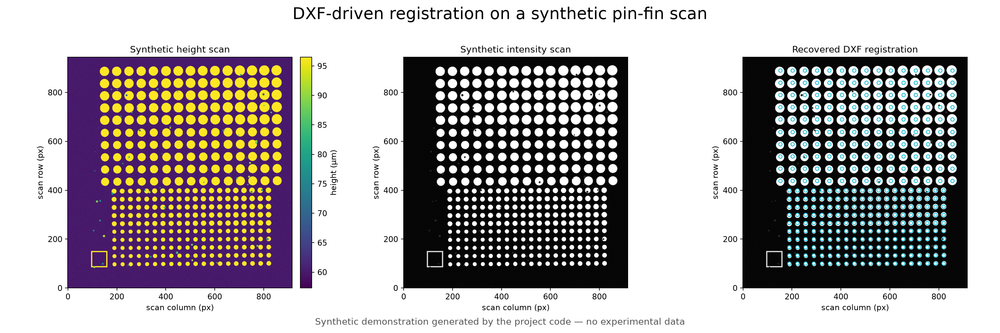
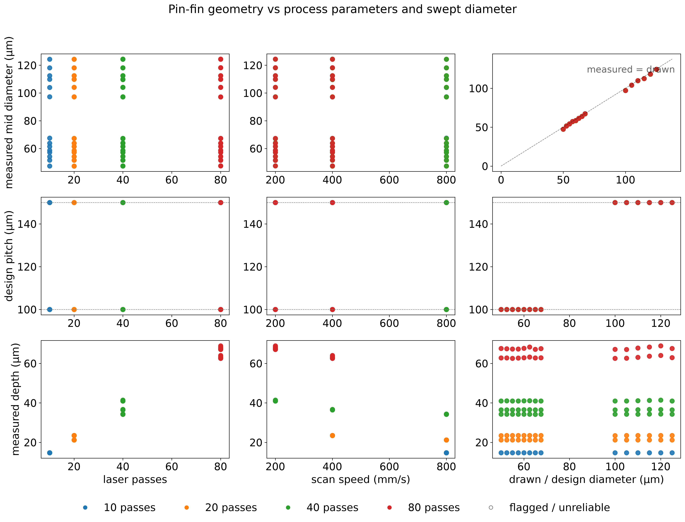
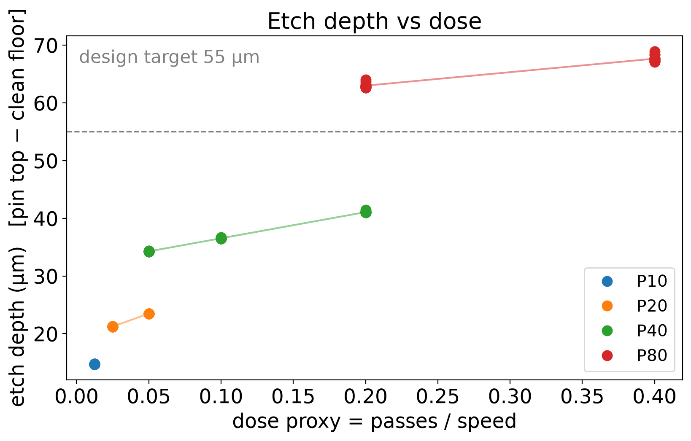

# DXF-driven metrology for UV-laser-fabricated pin-fin TIMs

> **Figure disclosure:** All figures on this landing page were generated by the
> repository's analysis code from deterministic synthetic scans. They contain no
> experimental measurements and should not be interpreted as validation data.

Python tooling for registering Keyence VK4 profilometry scans to fabrication CAD,
measuring every pin array in tiled samples, and converting laser-process sweeps into
auditable geometry and depth data.



*A synthetic height scan, its synthetic intensity channel, and the DXF registration
recovered by the project code. No experimental data are shown.*

This project supports the development of **pin-fin liquid-metal thermal interface
materials (PFLM TIMs)** fabricated by direct-write UV laser ablation. The fabrication
process is fast and compatible with backside wafer processing, but debris redeposition,
stage mirroring, tiled scans, and repeated pin lattices make the resulting data difficult
to analyze by hand.

The pipeline uses the fabrication DXF as the source of truth. It reconstructs the scan,
registers the designed geometry, separates pins from clean floor and debris, measures
the resulting structures, and produces presentation-ready figures plus machine-readable
results.

## At a glance

| | |
|---|---|
| **Inputs** | Keyence `.vk4` scans, fabrication `.dxf`, and laser-parameter maps |
| **Registration** | Alignment-marker detection, lattice-aware correlation, mirroring, and rotation |
| **Measurements** | Etch depth, pitch, base/mid/top diameter, taper, porosity, and debris metrics |
| **Outputs** | CSV measurements, QC overlays, height maps, calibration plots, and wafer-row summaries |
| **Interfaces** | Command-line workflows and an optional Tkinter desktop UI |

## Pipeline

1. **Read the design**

   Parse each DXF into unit cells, pin arrays, nominal diameters, pitches, lattice type,
   and alignment-marker geometry.

2. **Reconstruct and register the scan**

   Stitch a Keyence tile raster, find every unit cell, and solve the DXF-to-scan transform.
   The registration path handles the dataset's X mirroring and small stage rotations while
   failing closed when an absolute origin is ambiguous.

3. **Measure every array**

   Use the known pin lattice to classify pin, floor, and debris pixels. Estimate depth from
   the pin-top and floor populations, then build a stacked mean pin to measure base, mid,
   and top diameters without relying on fragile single-pin segmentation.

4. **Report and calibrate**

   Write per-array results and QC flags, render design-oriented figures, summarize wafer
   rows, and pool selected samples for process calibration.



*A report produced from 112 synthetic array measurements spanning eight simulated
process settings. The trends demonstrate report generation, not fabrication performance.*

## Why the CAD-driven approach matters

- Periodic structures can register one pitch away and still look correct. Unique markers,
  finite-array edges, and explicit ambiguity flags prevent a visually plausible but wrong
  array index from entering the results.
- Debris can stand taller than the underlying pin. The measurement therefore combines
  design coordinates, height classification, and stacked pin patches instead of selecting
  the tallest feature in the scan.
- Every excluded or unreliable measurement remains visible in the output with a reason;
  the pipeline does not silently discard inconvenient data.



*The reporting code recovers the programmed depth trend from synthetic scans. The
response, target line, and process settings are demonstrative rather than experimental.*

## Supported workflows

| Workflow | Use case | Entry point |
|---|---|---|
| Full tiled sample | A continuous `_Y{n}_X{m}` raster spanning multiple unit cells | `run_sample.py` |
| Independent snapshots | Separate interior/corner captures of one uniform cell | `run_sample.py --snapshots` |
| Wafer row | Multiple geometries and doses organized by wafer position | `run_row.py` |
| Cross-sample calibration | Pool reviewed measurements and compare depth models | `calibrate_depth.py` |
| Desktop interface | Browse inputs, launch runs, and preview results | `pflm_ui.py` |

## Quick start

The current dependency set is tested on **Python 3.13 for Windows**.

```powershell
git clone https://github.com/ryanscott2/Profilometer-Analysis.git
cd Profilometer-Analysis

python -m venv .venv
.venv\Scripts\Activate.ps1
python -m pip install -r requirements.txt
```

Launch the desktop interface:

```powershell
python pflm_ui.py
```

Or run a sample from the standard local folder structure:

```powershell
python run_sample.py
```

The default workflow expects `DXF/`, `VK4/`, `CSV/`, and `Results/` folders beside
the scripts. Explicit paths can also be supplied:

```powershell
python run_sample.py <vk4_dir> <out_dir> [<dxf>] [<cell_csv>]
```

Before running an entire wafer row, print and inspect the plan:

```powershell
python run_row.py --row 1 --vk4 <dir> --dxf-dir <dir> --dry-run
```

## Typical outputs

```text
Results/<dataset>/
├── figures/                 # clean, presentation-ready figures
├── legacy/
│   ├── measurements.csv    # one row per measured array
│   ├── figures/            # parameter-sweep and QC plots
│   └── qc/                 # optional per-array inspection images
├── registration.json       # transform and registration evidence
├── summary.txt              # concise run summary
└── manifest.json            # input/output provenance
```

Wafer-row runs add combined `row_measurements.csv`, `row_units.csv`, summary files,
and comparison figures without modifying the underlying per-sample datasets.

## Validation and quality control

Run the synthetic and regression test suite with:

```powershell
python selftest.py
```

The analysis records reliability flags for missing pins, physically impossible diameter
estimates, weak lattices, shallow relief, and registration ambiguity. QC graphics keep the
fitted geometry visible so measurements can be audited against the scan rather than accepted
as black-box outputs.

## Repository guide

| Module | Responsibility |
|---|---|
| `dxf_geometry.py` | Parse fabrication geometry and group pin arrays |
| `assemble.py` | Stitch Keyence tile rasters |
| `register.py` | Locate unit cells and solve design-to-scan transforms |
| `extract.py` | Classify pixels and measure pin geometry |
| `run_sample.py` | Analyze a full sample or snapshot set |
| `run_row.py` / `row_report.py` | Batch and summarize a wafer row |
| `calibrate_depth.py` | Cross-sample process calibration |
| `report.py` / `figstyle.py` | Shared reporting and figure styling |
| `pflm_ui.py` | Optional desktop interface |
| `synth.py` / `selftest.py` | Synthetic data and end-to-end validation |

## Detailed documentation

The implementation notes, file-naming rules, coordinate conventions, registration
failure modes, wafer-map schema, calibration methodology, and complete output contract are
preserved in the [technical reference](docs/technical-reference.md).

## Research status

This is active research software developed around a specific UV-laser PFLM fabrication
dataset. Review the registration evidence and QC outputs before using measurements for
process decisions, especially when applying the pipeline to new scan geometries or naming
conventions.
